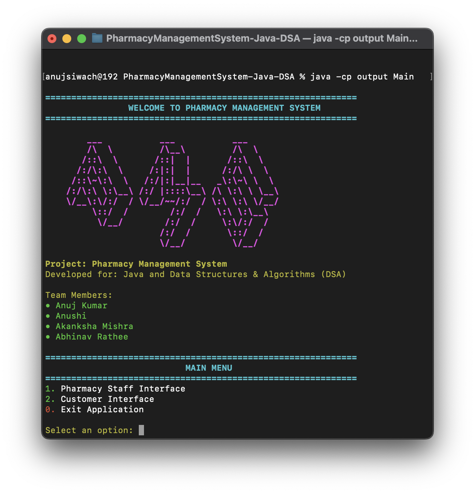

<div align="center">  

# 💊 Pharmacy Management System


## 🌟 ST-3 Final Project for Data Structures and Algorithms (DSA) and Java Subject


[Features](#-features) · [Project Structure](#-project-structure) · [Installation](#-installation) · [Usage](#-usage)

</div>

---

## 📌 Table of Contents
- [Overview](#-overview)
- [Features](#-features)
- [Project Structure](#-project-structure)
- [Technical Implementation](#-technical-implementation)
- [Installation](#-installation)
- [Usage](#-usage)
- [Data Structure Implementation](#-data-structure-implementation)
- [Contributors](#-contributors)
- [License](#-license)

## 📋 Overview
The Pharmacy Management System is a comprehensive Java application developed as a final project for the Data Structures and Algorithms (DSA) and Java course. This system provides a complete solution for pharmacy management, including inventory control, customer management, medicine tracking, and sales processing.



## 🚀 Features

- **🏥 Medicine Management**: Add, search, update, and remove medicines from inventory
- **👥 Customer Management**: Register customers, manage profiles, and track purchase history
- **🛒 Shopping Cart**: Easy-to-use interface for adding medicines to cart and checkout
- **📊 Inventory Management**: Track stock levels and receive low stock alerts
- **💰 Transaction Processing**: Process sales and maintain transaction history
- **🧾 Billing System**: Generate detailed bills for customers
- **💾 Data Persistence**: Save and load data using CSV files

## 🗂 Project Structure
<div style="width: 100%; height:600px ;">
    

</div>

## 💻 Technical Implementation

- **MVC Architecture**: Clean separation of concerns with Model-View-Controller pattern
- **Custom Data Structures**: Implementation of LinkedList, Queue, and MergeSort algorithms
- **File-based Storage**: CSV-based data persistence for easy deployment
- **Console UI**: User-friendly command-line interface with intuitive navigation
- **Modularity**: Well-organized code structure with clear separation of functionalities
- **Error Handling**: Robust error and exception handling throughout the application

## 🔧 Installation

### Prerequisites
- Java Development Kit (JDK) 8 or higher
- Git (optional)

### Setup Instructions

1. **Clone the Repository**
   ```bash
   git clone https://github.com/Anuj-er/PharmacyManagementSystem-Java-DSA.git
   cd PharmacyManagementSystem
   ```

2. **Compile the Project**
   ```bash
   javac -d output src/Main.java src/controller/*.java src/model/*.java src/data_structure/*.java src/util/*.java src/storage/*.java
   ```

3. **Run the Application**
   ```bash
   java -cp output Main
   ```

## 📱 Usage

After launching the application, you'll be presented with the main menu:

1. **For Pharmacy Staff**:
   - Medicine Management: Add, update, and remove medicines
   - Customer Management: Manage customer profiles
   - Inventory Management: Update quantities and check low stock
   - Transaction History: View past transactions

2. **For Customers**:
   - Browse available medicines
   - Search for specific medicines
   - Add medicines to cart
   - View and manage cart
   - Checkout and receive bills

## 🧮 Data Structure Implementation

This project implements several custom data structures:

- **MyLinkedList<T>**: A generic linked list implementation used throughout the system for dynamic data storage
- **MyQueue<T>**: A queue implementation used for processing orders
- **MergeSort**: An efficient sorting algorithm used for sorting medicines and transactions

Example implementation of MyLinkedList:
```java
public class MyLinkedList<T> {
    private Node<T> head;
    private int size;
    
    // Node inner class
    private static class Node<T> {
        T data;
        Node<T> next;
        
        Node(T data) {
            this.data = data;
            this.next = null;
        }
    }
    
    // Add element to the list
    public void add(T element) {
        Node<T> newNode = new Node<>(element);
        
        if (head == null) {
            head = newNode;
        } else {
            Node<T> current = head;
            while (current.next != null) {
                current = current.next;
            }
            current.next = newNode;
        }
        size++;
    }
    
    // Other methods: remove, get, size, isEmpty, etc.
}
```

## 👥 Contributors

- [Anushi 2310991700](https://github.com/Anushi13prsnl)
- [Anuj Kumar 2310991699](https://github.com/Anuj-er)
- [Abhinav Rathee 2310991675](https://github.com/abhinavrathee)
- [Akanksha Mishra 2310991681](https://github.com/akankshamishra2)

## 📜 License

This project is licensed under the MIT License - see the [LICENSE](LICENSE) file for details.

---

<div align="center">

### 💖 Made with ❤️ for the ST-3 Final Project

*"The best way to predict the future is to invent it." - Alan Kay*

[](https://github.com/yourname)

</div>
